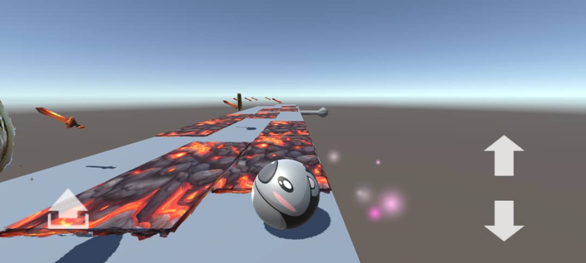

# 🐨 WildBall: Escape Dungeon

## 🎮 Game Overview

**WildBall: Escape Dungeon** is a fast-paced, physics-based escape game where you control a brave **Koala Ball** trying to survive and escape a dangerous dungeon filled with traps and deadly obstacles.

Navigate the dungeon, avoid spikes, dodge falling objects, and find your way to freedom!

---

## 🌟 Key Features

- ⚙️ Physics-based rolling and movement
- 🧠 Trap-dodging puzzle elements
- 🐨 Unique Koala Ball protagonist
- 🌐 Cross-platform: Play on **PC**, **WebGL**, and **Android**

---

## 🎯 Objective

- Guide the **Koala Ball** through each level of the dungeon.
- Avoid traps like spikes, holes, moving blades, and lava.
- Survive to reach the end of each dungeon section.
- Escape the dungeon to win!

---

## 🕹️ Controls (Cross-Platform)

### 🖥️ PC

| Action      | Key             |
|-------------|------------------|
| Move        | `A / D` or `← / →` |
| Jump        | `Spacebar`       |
| Restart     | `R`              |
| Quit        | `Esc`            |

### 📱 Android

- **Touch Joystick** for movement
- **Touch Button** for jump

### 🌐 WebGL

- Same controls as PC
- Playable in-browser (no installation)

---

## 🚀 Getting Started
